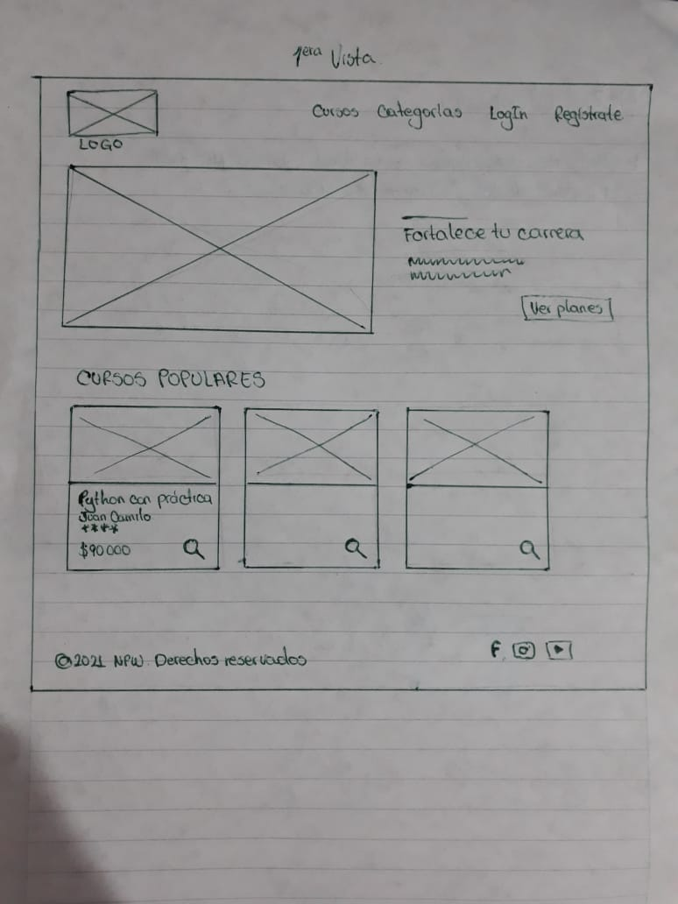
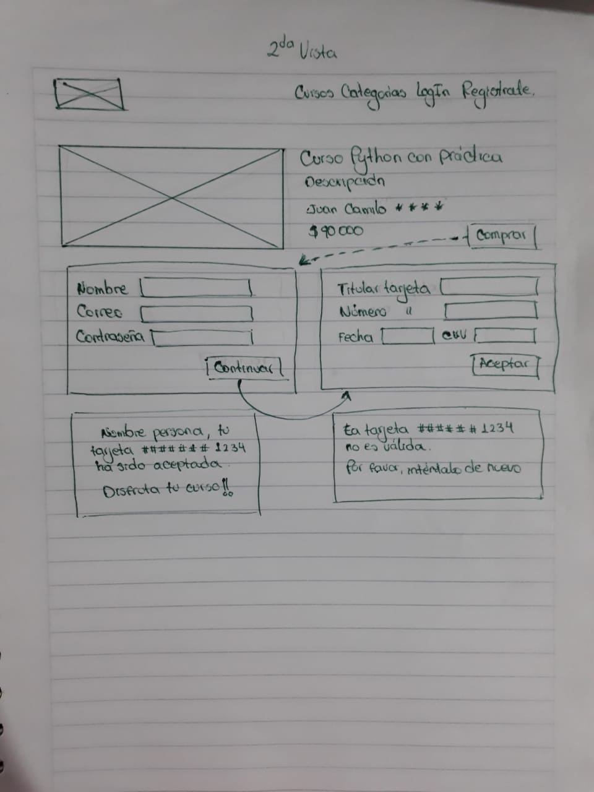
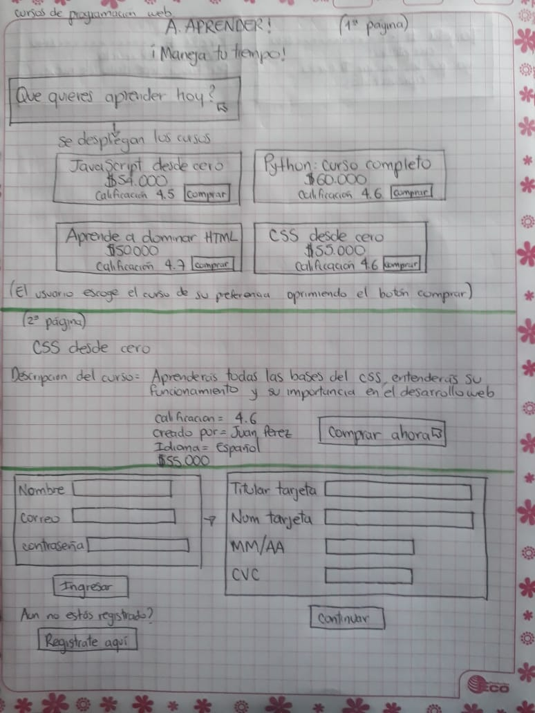
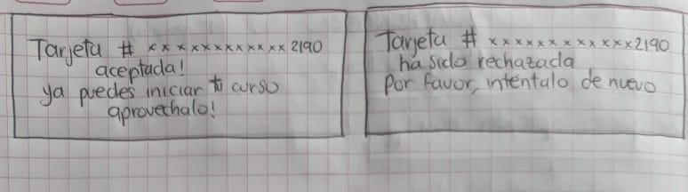

# A.Aprender

## Índice

* [1. Resumen del proyecto](#1-resumen-del-proyecto)
* [2. Investigación UX](#2-investigacion-ux)
* [3. Objetivos de aprendizaje](#3-objetivos-de-aprendizaje)

***

## 1. Resumen del proyecto
A.Aprender es una plataforma web donde podrás encontrar los cursos que son fundamentales para dar incio a tu carrera como desarrollador web.

***

## 2. Investigación UX
### 2.1 A quién va dirigido
 Dirigido a personas sin distinción de edad que quieran adquirir habilidades en programación sin requerir de conocimientos previos   
 

### 2.2 Cómo soluciona los problemas/necesidades del usuario
 Los cursos aquí presentados cuentan con precios cómodos con un módulo de pago fácil, rápido y seguro. Son cursos pensados en los usuarios que por falsos comentarios acerca del mundo de la programación no se atreven a iniciar su proceso de formación
 

### 2.3 Primer prototipo

 

### 2.4 Feedback
 Al momento de tener los prototipos que hicimos en papel, decidimos pedir feedback en el cual nos dieron recomendaciones como:

* En la vista 1, cambiar botón "comprar" de cada curso, por "ver detalles" o "ver más".
* Quitar menú superior y formulario de registro de usuario ya que la finalidad del proyecto se enfocaba era en el módulo de compra.
* Resaltar título de cada curso

### 2.5 Prototipo final(Realizado en Figma)
 

## 3. Objetivos de aprendizaje
 

### HTML y CSS

* [x ] [Uso de HTML semántico.](https://developer.mozilla.org/en-US/docs/Glossary/Semantics#Semantics_in_HTML)
* [x ] Uso de selectores de CSS.
* [x ] Construir tu aplicación respetando el diseño realizado (maquetación).

### DOM

* [x ] Uso de selectores del DOM.
* [x ] Manejo de eventos del DOM.
* [x ] [Manipulación dinámica del DOM.](https://developer.mozilla.org/es/docs/Referencia_DOM_de_Gecko/Introducci%C3%B3n)
(appendChild |createElement | createTextNode| innerHTML | textContent | etc.)

### JavaScript

* [x ] Manipulación de strings.
* [x ] Uso de condicionales (if-else | switch | operador ternario)
* [x ] Uso de bucles (for | for..in | for..of | while)
* [x ] Uso de funciones (parámetros | argumentos | valor de retorno)
* [x ] Declaración correcta de variables (const & let)

### Testing

* [x ] [Testeo unitario.](https://jestjs.io/docs/es-ES/getting-started)

### Estructura del código y guía de estilo

* [x ] Organizar y dividir el código en módulos (Modularización)
* [x ] Uso de identificadores descriptivos (Nomenclatura | Semántica)
* [x ] Uso de linter (ESLINT)

### Git y GitHub

* [x ] Uso de comandos de git (add | commit | pull | status | push)
* [ ] Manejo de repositorios de GitHub (clone | fork | gh-pages)

### UX

* [x ] Diseñar la aplicación pensando y entendiendo al usuario.
* [x ] Crear prototipos para obtener feedback e iterar.
* [x ] Aplicar los principios de diseño visual (contraste, alineación, jerarquía)

